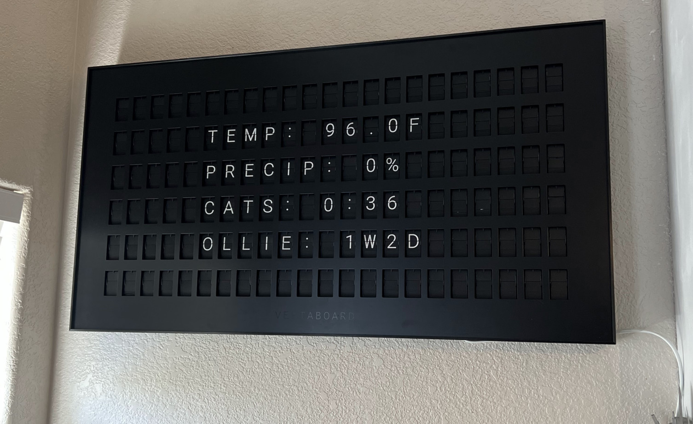

# Vestaboard Display Controller

A Python-based controller for Vestaboard that displays personalized real-time information including weather, time tracking, and custom counters. Saves $7/month by avoiding Vestaboard's subscription service



## What It Does

This script updates the Vestaboard every 20 minutes:
- **Current Weather**: Temperature and precipitation chance for your location
- **Work/Activity Time**: Fetches time data from [cat work tracker](https://tylerbarron.com/CatTracker)
- **Custom Date Counter**: Tracks days/weeks since a specified date
- **Quiet Hours**: Automatically pauses updates during nighttime (11 PM - 6 AM)

## Setup

1. **Install Dependencies**:
   ```bash
   pip install requests
   ```

2. **Configure API Keys**:
   Create a `config.py` file in the same directory (you can copy `config.example.py`):

3. **Get API Keys**:
   - **Vestaboard**: Get your Read/Write key from [Vestaboard API](https://www.vestaboard.com/)
   - **Weather**: Sign up for a free API key at [OpenWeatherMap](https://openweathermap.org/api)

4. **Customize Your Display**:
   - Date tracking: Edit your dates and counter label in `config.py`
   - Custom API endpoints: Edit `vestaboard.py` line 21
   - Update intervals and quiet hours: Edit `vestaboard.py` lines 24-27

## Running the Script

**Manual Start**:
```bash
python vestaboard.py
```

**Automatic Monitoring** (using the included monitor script):
```bash
chmod +x monitor_script.sh
./monitor_script.sh
```

Add to crontab for automatic restart on reboot:
```bash
*/5 * * * * /path/to/monitor_script.sh
```